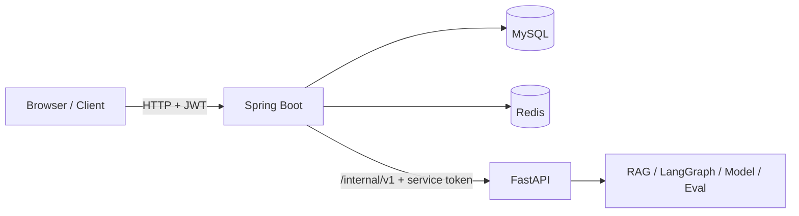

# 畜牧业 Agentic RAG 企业智能助手

这是一个“Java 企业业务层 + Python AI 能力层”的本机可复现项目。Spring Boot 负责用户、权限、会话、任务、审计和业务数据；FastAPI 负责 RAG、LangGraph Agent 编排、问诊、模型调用、安全决策与评测；Java 通过版本化 HTTP 契约调用 Python。MySQL 保存耐久业务事实，Redis 保存认证状态与可重建的 opaque AI context，Docker Compose 负责四服务部署。

项目的个人标签是：既能完成大模型应用，也能把 AI 能力接入有身份、数据、事务和稳定性约束的企业业务系统。

## 当前状态

V7 P0–P7 本机开发与验收已完成，P7.2 发布门禁为 `PASS`：

- Java `clean verify`：127 tests，0 failures/errors/skipped；
- Python 全量：611 passed，3 skipped；
- Compose：Java、Python、MySQL、Redis healthy，只有 Java 发布 `127.0.0.1:8080`；
- 安全扫描：源码 0 findings；最终 Java/Python 镜像均为 0 个“已有修复版本的 HIGH/CRITICAL”；
- 业务 stub：50 VU、5 分钟、15,001 请求、0 错误、p95 27.83 ms；
- AI stub：20 个独立会话、5 分钟、4,932 请求、0 错误、p95 1.684 s；
- Codex 内置浏览器：登录、服务状态、建会话、中文问诊、引用/工具链和刷新持久化通过。

这些性能数字来自 Windows 本机 deterministic fake RAG/stub，不是生产 SLA，也不是实际模型性能。详细证据见 `docs/reports/P7_SECURITY_PERFORMANCE_RELEASE_REPORT.md`。

当前工作位于 `codex/java-enterprise-integration` 工作树；提交/发布状态与“本机已实现并验证”是不同概念，引用简历表述前应确认 Git 交付状态。

## 架构



- Java 是唯一公共入口和业务事实源；
- Python 不读取用户 JWT、不直连 Java MySQL、不修改 Java Redis 对象；
- MySQL `contextVersion` 是唯一版本权威，Redis context 可丢失并由有界历史重建；
- Java 调用 Python 时不持有 MySQL 长事务；响应丢失通过 operation record 对账；
- 用户 JWT 和内部 service token 完全分离。

完整 as-built 架构、事务边界与未覆盖范围见 `docs/V7_ARCHITECTURE_AND_BOUNDARIES.md`。

## 主要能力

### Java 企业业务层

- Spring Security JWT、refresh rotation/replay revoke、RBAC 与资源所有权；
- 用户、角色、会话、消息、任务状态机和脱敏审计；
- MySQL + Flyway + JPA，唯一约束、索引、乐观锁和事务化业务/审计；
- Redis refresh family/撤销/TTL 与 opaque AI context CAS；
- 文档上传、可靠索引任务、体尺业务快照和 SQLite→MySQL 停机迁移；
- Resilience4j chat timeout/circuit breaker/bulkhead、readiness、结构化日志和 Micrometer 指标。

### Python AI 能力层

- LangGraph 条件图编排 Supervisor、RAG、动态疾病理解、Verifier、Safety 和 Response；
- 真实 RAG-SERVER MCP stdio 的本机可选集成，以及 citation/source URI 映射；
- 低置信度无答案、证据门、安全拒答和模型 fallback；
- chat、measurement、document ingestion 的 `/internal/v1` 幂等 execution contract；
- fake、real RAG、Agent、安全与本地模型分层评测。

## 快速启动：可复现 Compose profile

前置条件：Docker Desktop/Compose。

```powershell
Copy-Item -LiteralPath '.env.example' -Destination '.env'
```

编辑 `.env`，替换所有 `change-me`，不要提交真实 secret。然后：

```powershell
docker compose config --quiet
if ($LASTEXITCODE -ne 0) { exit $LASTEXITCODE }
docker compose up --build --detach --wait
```

打开：

```text
http://127.0.0.1:8080/
```

使用 `.env` 中的 bootstrap admin 登录。bootstrap 只在空库中创建账号；复用旧 MySQL volume 时不会用新环境变量重置密码。

停止并保留数据：

```powershell
docker compose down
```

不要在日常操作中使用 `down -v`。详细启动、健康、日志、指标和故障恢复见 `docs/V7_OPERATIONS_RUNBOOK.md`。

## fake 与真实 RAG 边界

可复现 Compose profile 固定使用 `config/settings.compose.yaml` 与 `RAG_QUERY_MODE=fake`，用于验证 Java/Python 契约、Agent 输出结构、状态机、安全和性能；它不证明真实知识库质量。

本机开发可显式配置 sibling `RAG-SERVER`，通过 MCP stdio 使用真实 collection：

```powershell
$env:RAG_SERVER_PATH = 'C:\path\to\RAG-SERVER'
.venv\Scripts\python.exe -m pytest -m rag_server
.venv\Scripts\python.exe scripts\run_eval.py --mode real --optional --output-dir reports\real
```

当前 Docker 镜像没有打包 RAG-SERVER，真实 RAG Compose 仍是明确缺口。不得把 stub 测试或历史 real 报告描述成当前真实模型性能/质量。

## API 入口

客户端只调用 Java `/api/v1`：

- `/api/v1/auth/*`、`/users`、`/conversations`、`/tasks`、`/audit-logs`；
- `/api/v1/documents`、`/measurements/analyze`、`/system/status`；
- `/actuator/health/liveness`、`/readiness`、受权限保护的 `/prometheus`。

Java 只通过内部 `/internal/v1` 调用 Python。完整字段与状态码以 `contracts/business-api-v1.yaml` 和 `contracts/ai-service-v1.yaml` 为准；导航见 `docs/API_SPEC.md`。

## 测试与发布

```powershell
# Java clean verify（含隔离 MySQL/Redis 集成测试）
.\scripts\check_p2_java.ps1 -OutputDir .tmp_tests\java

# Python 全量
.venv\Scripts\python.exe -m pytest -q

# Compose 构建、健康、登录和端口边界
.\scripts\check_p2_compose.ps1 -OutputDir .tmp_tests\compose

# 依赖故障演练
.\scripts\check_p7_resilience.ps1

# secret 与镜像漏洞门禁
.\scripts\check_p7_security.ps1 -OutputDir .tmp_tests\security

# 完整 V7 门禁；两组性能各运行 5 分钟
.\scripts\check_release_v7.ps1 -IncludePerformance
```

`-Skip*` 仅用于定位问题，带跳过项的结果不能替代完整发布验收。真实 AI benchmark 必须显式使用 `--profile ai-real --confirm-real-ai` 并填写模型、知识库与规模。

## 文档入口

- `docs/V7_ARCHITECTURE_AND_BOUNDARIES.md`：as-built 架构、数据所有权与边界；
- `docs/API_SPEC.md`：Java 公共 API 与 Python 内部 API 导航；
- `docs/V7_OPERATIONS_RUNBOOK.md`：启动、健康、日志、指标、故障和升级；
- `docs/V7_MIGRATION_RUNBOOK.md`：P4/P6 SQLite→MySQL 停机迁移；
- `docs/DEMO_SCRIPT.md`：AI 岗与 Java/银行央企岗演示脚本；
- `docs/P7_RESUME_EVIDENCE.md`：双版本简历表述与源码/测试/报告证据；
- `docs/reports/P7_FINAL_DELIVERY_REPORT.md`：P0–P7 最终交付索引；
- `docs/DEV_SPEC_V7_JAVA_ENTERPRISE_INTEGRATION.md`：历史设计/开发基线，不作为完成报告；
- `docs/adr/`：服务边界、幂等/对账、RAG 打包决策。

## 安全与能力边界

系统提供畜牧业辅助建议，不替代执业兽医诊断，不输出具体药物剂量或确定性处方。真实引用是资料依据，不等同于诊断结论。

当前未覆盖 Kubernetes、服务网格、MySQL/Redis 高可用、生产备份自动化、生产告警、公网部署、合规认证、真实 LoRA 默认推理、真实 RAG Compose 和真实模型性能。不要将项目描述为“银行级生产系统”“高可用微服务集群”或“已上线公网”。
