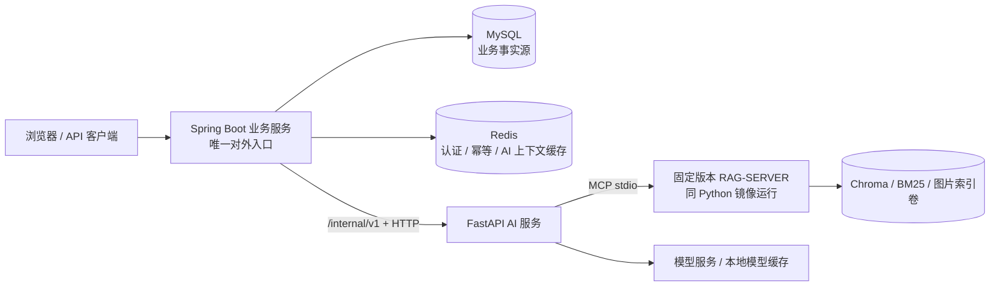

# V7 Java 企业业务层集成开发计划

> 文档定位：这是 V7 开工前的历史设计与阶段计划，不是当前完成态报告。已实现架构以 `V7_ARCHITECTURE_AND_BOUNDARIES.md` 为准，最终验收以 `reports/P7_FINAL_DELIVERY_REPORT.md` 为准；其中规划的真实 RAG Compose 打包仍未完成。

## 1. 结论

本次改造有条件可行，且比另起一个纯 Java 项目更能形成个人技术标签。

推荐目标架构是：

- 一个 Spring Boot 模块化单体，作为唯一对外业务入口；
- 一个 FastAPI AI 服务，保留现有 RAG、LangGraph、问诊、模型、安全和评测能力；
- MySQL 保存耐久业务事实；
- Redis 保存可过期、可重建的登录和 AI 会话状态；
- Java 通过版本化 HTTP 接口调用 Python；
- Docker Compose 提供单机可复现部署。

这不是“大规模微服务架构”，也不是生产高可用集群。它是一套边界清楚、可测试、可演示、能够支撑双版本简历的企业 AI 应用。

### 1.1 可行性的两个前置条件

1. Java/MySQL、Python/SQLite 不能同时成为会话、消息或任务的事实源。
2. 真实 `RAG-SERVER` 必须从本机绝对路径依赖变成固定版本、可装入 Python 镜像的依赖。

任一条件未解决，都不能声称完成了企业业务层或可复现 Compose 部署。

## 2. 当前仓库证据

当前项目已经具备本次改造所需的 AI 核心：

- FastAPI 入口和现有路由：`backend/app/main.py`
- LangGraph Agent 编排：`backend/app/agent/graph.py`、`backend/app/agent/langgraph_workflow.py`
- RAG-SERVER 适配和引用映射：`backend/app/integrations/rag_server/`
- 低置信度和无依据回答策略：`backend/app/schemas/rag_server.py`、`backend/app/agent/rag_answer_policy.py`
- 问诊证据门、Verifier 和 Safety：`backend/app/agent/`
- 会话、任务、业务数据和 AI trace 的 SQLite 表：`backend/app/db/migrations.py`
- fake、real RAG、Agent、安全和模型路由评测：`backend/app/evaluation/`、`scripts/run_eval.py`

当前企业能力缺口也很明确：

- `user_id` 和 `X-Client-ID` 是客户端可伪造字段，不是真实认证；
- 数据库连接只支持 SQLite；
- 会话、任务、业务数据和 AI 观测数据混在同一 SQLite；
- 文档索引仍由 FastAPI 同步调用 CLI；
- 现有验证错误使用 HTTP 200，不适合作为新的服务间契约；
- 没有 Java、MySQL、Redis、Dockerfile 或 Compose；
- 真实 RAG 依赖 sibling `RAG-SERVER` 和 Windows 本机路径；
- README 已明确说明没有多用户权限、企业审计和公网生产部署。

本次计划制定时执行的相关基线测试：

```powershell
.\.venv\Scripts\python.exe -m pytest `
  tests\integration\test_api_contract.py `
  tests\integration\test_sqlite_schema.py `
  tests\integration\test_task_and_log_repository.py `
  tests\integration\test_langgraph_workflow.py `
  tests\integration\test_eval_runner.py `
  tests\unit\test_rag_answer_policy.py `
  tests\unit\test_disease_evidence_gate.py -q
```

结果：`60 passed`。

这只证明相关局部基线，不替代完整 V6 回归和真实 RAG 质量门禁。

## 3. 范围

### 3.1 必须完成

- 用户管理、登录、刷新、登出和禁用；
- 基于 Spring Security 的 RBAC；
- 会话和消息的资源所有权校验；
- AI 任务创建、状态查询和幂等；
- 关键业务操作审计；
- Java 到 Python 的版本化内部 HTTP 契约；
- MySQL 业务持久化；
- Redis 登录状态、幂等和 Python 临时问诊上下文；
- 超时、熔断、并发隔离和明确降级；
- Java、Python、MySQL、Redis 的 Compose 部署；
- 正常回答、低置信度、安全拒答、越权和 Python 故障的自动化验证；
- 双版本简历所需的源码、测试、报告和演示证据。

### 3.2 第一版不做

- Spring Cloud 全家桶、注册中心、配置中心和独立网关；
- 将用户、权限、会话、任务和审计拆成多个 Java 微服务；
- Kafka、RabbitMQ、Saga、Seata 或分布式事务；
- Kubernetes、服务网格、MySQL/Redis 高可用；
- 多租户、复杂 ABAC、组织树和审批流；
- 独立 OAuth2 授权服务器和第三方登录；
- WebSocket/SSE 流式回答；
- 通用任务调度平台；
- Elasticsearch 审计搜索和完整 ELK；
- 默认镜像内置大型模型权重；
- 重写现有 RAG、Agent、安全或评测实现；
- 将 Compose 单机部署包装成“生产高可用”。

## 4. 目标架构



### 4.1 调用方向

固定调用方向：

`客户端 -> Java -> Python -> RAG-SERVER / 模型`

不允许：

- 前端直接调用 Python；
- Python验证用户 JWT 或自行做用户 RBAC；
- Java复制 Agent 路由、安全、引用或低置信度判断；
- Python直连 Java 的 MySQL；
- Java和 Python共同修改同一个 Redis 对象；
- 两侧同时写同一份业务会话、消息或任务。

### 4.2 Java 模块

建议在一个 Spring Boot 工程内按业务包组织：

- `iam`：用户、角色、权限、认证和令牌；
- `conversation`：会话、消息和资源所有权；
- `task`：AI 任务、状态机、幂等和对账；
- `audit`：审计事件、查询和脱敏；
- `livestock`：农场、动物和体尺业务数据；
- `knowledge`：文档元数据和索引任务；
- `ai`：Python HTTP 客户端、DTO、错误映射和韧性；
- `common`：统一响应、异常、请求 ID、分页和时间处理。

不要为了展示 DDD 而创建空洞的多模块 Maven 工程。第一版使用单个 Maven 工程和清晰包边界即可。

### 4.3 Python 边界

Python 保留：

- RAG 检索、引用映射和 RAG-SERVER MCP 接入；
- LangGraph/Agent 编排；
- 问诊槽位提取、追问和上下文更新；
- 模型路由、fallback 和工具调用；
- 低置信度、无证据、安全拒答；
- Agent/RAG/model/tool trace；
- 离线评测、真实 RAG 评测和质量门禁。

Python 不再负责：

- 用户和角色；
- 对话的资源所有权；
- 耐久消息历史；
- 业务任务最终状态；
- 农场、动物和体尺主数据；
- 跨请求 AI 上下文存储；
- 企业审计事实。

## 5. 建议目录

保持现有 Python 目录，避免先做大规模重构：

```text
.
├── backend/                         # 现有 FastAPI / Agent / RAG
├── java-app/
│   ├── pom.xml
│   ├── mvnw
│   ├── mvnw.cmd
│   └── src/
│       ├── main/java/
│       ├── main/resources/
│       │   ├── application.yml
│       │   ├── db/migration/
│       │   └── static/
│       └── test/java/
├── contracts/
│   └── ai-service-v1.yaml
├── docker/
│   ├── java.Dockerfile
│   └── python.Dockerfile
├── third_party/
│   └── rag-server/                  # 推荐固定 commit 的 Git submodule
├── compose.yaml
├── .env.example
└── docs/
```

推荐 Java 基线：

- Java 17 LTS；
- Spring Boot 3.x；
- Maven；
- Spring Web、Security、Validation、Data JPA、Data Redis、Actuator；
- Flyway、MySQL Driver、Resilience4j；
- Testcontainers 和 WireMock。

第一版不要同时混用 JPA 和 MyBatis。

## 6. 数据所有权

| 数据 | 目标事实源 | 说明 |
|---|---|---|
| 用户、角色、权限 | Java + MySQL | Python不感知权限结构 |
| 登录刷新状态、撤销 | Java + Redis | 保存不可逆 token 摘要和 TTL |
| 会话元数据、消息 | Java + MySQL | Java每次向 Python传递有界历史 |
| AI 任务最终状态 | Java + MySQL | Python只返回执行结果或 job 状态 |
| 审计事件 | Java + MySQL | append-only，无普通删除接口 |
| 农场、动物、体尺记录 | Java + MySQL | Python接收授权后的数据快照 |
| 文档元数据、索引任务 | Java + MySQL | 文件内容使用共享卷/object key |
| 问诊槽位、待追问状态 | Java + Redis | Java保存 Python返回的 opaque、版本化上下文 |
| AI 短期执行日志 | Python 运维库 | 按 operation ID 对账，TTL/定期清理，不替代 Java任务 |
| Agent/RAG/model/tool trace | Python 运维数据 | Java只存 request_id 和摘要 |
| 评测报告 | Python 文件/CI 产物 | 不作为 Java业务表 |
| 向量、BM25、图片索引 | RAG-SERVER 持久卷 | 不迁入 MySQL |

### 6.1 Redis namespace

Redis 由 Java 持有。Python不直连 Redis，只把上下文视为输入/输出 DTO：

- `java:auth:*`
- `java:token-revoked:*`
- `java:idempotency:*`
- `java:rate-limit:*`
- `java:ai-context:{userId}:{conversationId}`

AI 上下文是 Python定义 schema、Java不解释内容的 opaque JSON。MySQL `conversation.context_version` 是唯一版本权威；Redis缓存必须携带相同版本。Java每次仍传递最近有限轮消息，因此 Redis 丢失或版本落后时，Python可以从历史安全重建上下文，而不是丢失耐久会话。

Java删除会话时同时删除自己的 Redis context key。Redis删除失败时依靠 TTL 最终清理，并记录审计/告警。

### 6.2 当前 SQLite 表迁移

| 当前表 | 处理 |
|---|---|
| `conversation` | 迁到 Java `conversation` |
| `qa_log` | 拆为 `conversation_message` 和 AI 调用摘要 |
| `rag_ingestion_task` | 迁到 Java `biz_task` / `knowledge_document` |
| `farm_profile` | 迁到 Java `farm` |
| `animal_profile` | 迁到 Java `animal` |
| `body_measurement_record` | 迁到 Java `measurement_record` |
| `session_context` | 迁为 Java Redis 中的 opaque AI context cache |
| `agent_trace_log` | Python保留 |
| `rag_trace_log` | Python保留 |
| `model_route_log` | Python保留 |
| `tool_call_log` | Python保留 |
| `eval_run_log` | Python保留或改为评测文件 |
| `memory_event/farm_memory/animal_memory` | 当前未默认启用；启用时由 Java保存审核后的耐久记忆，Python只返回候选 |

Python新增的 `ai_execution_record` 属于技术执行日志，只保存 `operation_id`、请求 hash、运行状态、最终响应、时间和过期时间。它应放在持久化运维卷中，并定期清理；Java/MySQL仍是业务任务和消息的唯一事实源。

### 6.3 迁移策略

每个业务域采用一次停机切换，不做双写。会话/消息/任务在 P4 切换，农场/动物/体尺在 P6 切换；两次迁移使用同一套流程：

1. 停止旧业务写入；
2. 备份 SQLite 并记录文件 hash；
3. Flyway 创建该业务域尚未存在的 MySQL 表；
4. 只读导出 SQLite；
5. 转换 JSON、UTC 时间、布尔值、主外键和状态；
6. 将 `anonymous/legacy` 映射到隔离的 legacy 用户，不冒充真实用户；
7. 导入 MySQL；
8. 对账表计数、唯一 ID、外键、时间范围和抽样内容；
9. 切换该业务域的 Java 入口；
10. SQLite 只读保留一个版本后归档。

禁止把 SQLite 的 `ON CONFLICT`、`STRFTIME` 或 `PRAGMA` 直接搬到 MySQL。
禁止在已产生新 MySQL 业务数据后再执行假设“空库”的全量导入；导入工具必须限制目标业务域，并在非空目标表上默认拒绝执行。

## 7. MySQL 核心模型

### 7.1 IAM

- `sys_user`
- `sys_role`
- `sys_permission`
- `sys_user_role`
- `sys_role_permission`

最低角色：

- `ADMIN`
- `VET`
- `AUDITOR`
- `USER`

最低权限：

- `USER_MANAGE`
- `AI_CHAT`
- `MEASUREMENT_ANALYZE`
- `CONVERSATION_READ_OWN`
- `CONVERSATION_READ_ALL`
- `DOCUMENT_UPLOAD`
- `TASK_READ_OWN`
- `TASK_MANAGE`
- `TRACE_READ`
- `AUDIT_READ`

RBAC 之外必须有资源所有权检查。普通用户不能读取其他用户的会话、消息、任务、动物数据或文档。

### 7.2 会话和消息

`conversation` 关键字段：

- `id`
- `owner_id`
- `title`
- `status`
- `context_version`
- `active_operation_id`
- `version`
- `created_at`
- `updated_at`
- `last_message_at`

`conversation_message` 关键字段：

- `id`
- `conversation_id`
- `turn_id`
- `role`
- `content`
- `request_id`
- `status`
- `intent`
- `risk_level`
- `evidence_status`
- `metadata_json`
- `created_at`

约束：

- `UNIQUE(conversation_id, turn_id, role)`
- `INDEX(conversation_id, created_at)`
- `UNIQUE(request_id, role)` 或等价防重约束

### 7.3 任务

`biz_task` 关键字段：

- `id`
- `owner_id`
- `conversation_id`
- `type`
- `operation_id`
- `executor_job_id`
- `status`
- `progress`
- `result_ref`
- `error_code`
- `retry_count`
- `version`
- `created_at`
- `started_at`
- `finished_at`

约束：

- `UNIQUE(owner_id, operation_id)`
- `INDEX(status, created_at)`
- `INDEX(owner_id, created_at)`

任务状态：

```text
CREATED -> RUNNING -> SUCCEEDED
                   -> FAILED
                   -> TIMED_OUT
CREATED/RUNNING -> CANCELLED
CREATED/RUNNING -> SUBMIT_UNKNOWN
SUBMIT_UNKNOWN  -> RUNNING/SUCCEEDED/FAILED
```

状态只能单调推进。使用乐观锁或条件更新阻止过期结果覆盖新状态。

### 7.4 审计

`audit_log` 至少保存：

- `actor_id`
- `action`
- `resource_type`
- `resource_id`
- `request_id`
- `result`
- `client_ip`
- `user_agent`
- `detail_json`
- `created_at`

关键业务状态变更和对应审计应在同一个 MySQL 事务中提交。审计不记录密码、JWT、服务 token、API key、完整 prompt 或未脱敏问诊文本。

## 8. API 设计

### 8.1 Java 对外 API

第一版建议：

- `POST /api/v1/auth/login`
- `POST /api/v1/auth/refresh`
- `POST /api/v1/auth/logout`
- `GET /api/v1/users`
- `POST /api/v1/users`
- `PATCH /api/v1/users/{id}/status`
- `PUT /api/v1/users/{id}/roles`
- `POST /api/v1/conversations`
- `GET /api/v1/conversations`
- `GET /api/v1/conversations/{id}`
- `PATCH /api/v1/conversations/{id}`
- `DELETE /api/v1/conversations/{id}`
- `POST /api/v1/conversations/{id}/messages`
- `POST /api/v1/measurements/analyze`
- `POST /api/v1/documents`
- `POST /api/v1/tasks`
- `GET /api/v1/tasks/{id}`
- `GET /api/v1/audit-logs`
- `GET /actuator/health/liveness`
- `GET /actuator/health/readiness`

只有 Java 解析用户 JWT。对外返回中不暴露完整 Agent trace、模型 prompt 或内部服务错误堆栈。

### 8.2 Python 内部 API

新增 `/internal/v1`，保留旧 `/api` 供过渡测试，但默认 Compose 不对外暴露：

- `POST /internal/v1/ai/chat`
- `GET /internal/v1/ai/runs/{operationId}`
- `POST /internal/v1/ai/measurements/analyze`
- `POST /internal/v1/ai/knowledge/ingestions`
- `GET /internal/v1/ai/operations/{operationId}`
- `GET /internal/v1/rag/collections`
- `GET /internal/v1/rag/collections/{collection}/documents/{docId}/summary`
- `GET /internal/v1/health/liveness`
- `GET /internal/v1/health/readiness`

评测第一版继续通过 Python CLI/CI 运行，不新增公网或 Java 异步评测接口。

`GET /internal/v1/ai/runs/{operationId}` 查询 Python 的短期执行日志，用于 Java在 chat 响应丢失或超时后对账。它不是会话或任务事实源。

### 8.3 Chat 契约

请求示例：

```json
{
  "requestId": "req_uuid",
  "operationId": "turn_uuid",
  "conversationId": "conv_uuid",
  "userId": "internal_user_id",
  "query": "牛持续咳嗽并且体温升高怎么办？",
  "animalSnapshot": {
    "animalId": "animal_uuid",
    "species": "cattle"
  },
  "history": [],
  "context": {
    "schemaVersion": 1,
    "slots": {}
  },
  "contextVersion": 3,
  "deadlineMs": 60000
}
```

响应示例：

```json
{
  "requestId": "req_uuid",
  "runId": "run_uuid",
  "outcome": "NEEDS_FOLLOW_UP",
  "answer": "还需要确认体温、持续时间和是否群体发病。",
  "intent": "disease_consultation",
  "riskLevel": "high",
  "evidenceStatus": "low_confidence",
  "sources": [],
  "followUpQuestions": [
    "体温是多少？",
    "症状持续多久？"
  ],
  "toolsUsed": ["query_knowledge_hub"],
  "nextContext": {
    "schemaVersion": 1,
    "slots": {}
  },
  "contextVersion": 4,
  "traceId": "trace_uuid"
}
```

Java只持久化和回传 `context`/`nextContext`，不解释 Python定义的内部 slot。响应 `contextVersion` 必须等于请求版本加一。

领域结果：

- `ANSWERED`
- `NEEDS_FOLLOW_UP`
- `LOW_CONFIDENCE`
- `SAFETY_REFUSAL`

这些结果都是成功完成业务判断，使用 HTTP 200，不能触发熔断或自动重试。

### 8.4 HTTP 语义

- `200`：同步完成，包括低置信度和安全拒答；
- `202`：异步索引任务已接受；
- `400/422`：请求或 schema 错误；
- `401/403`：内部服务认证失败；
- `409`：幂等冲突或上下文版本冲突；
- `429`：并发或速率受限；
- `502`：AI 依赖返回无效响应；
- `503`：AI/RAG/模型不可用；
- `504`：调用超时。

内部契约必须定义稳定的机器错误码，Java不能只解析文本消息。

### 8.5 服务认证

- 用户 JWT 只终止在 Java；
- Python 接受轮换的内部 Bearer/HMAC 服务凭证；
- Java以受信任 header 传递内部 user ID，但 Python不把它当权限判断依据；
- Compose 内部网络不是认证替代品；
- mTLS 后置，不进入第一版。

## 9. 一致性、幂等与韧性

### 9.1 Chat 写入顺序

不要在持有 MySQL 长事务时调用 Python：

1. 事务 A：校验权限，按幂等键创建 `biz_task` 和用户消息，通过 `active_operation_id`/条件更新独占该会话 turn，写审计，提交；
2. Java从 Redis读取与 MySQL `context_version` 匹配的 opaque context；缓存缺失时传空 context 和有界历史；
3. Java将任务置为 `RUNNING`，在事务外调用 Python；
4. Python先按 `operationId + request_hash` 创建持久化 `ai_execution_record`，同 key 同请求返回已有状态/结果，不同请求返回 409；
5. Python完成推理后先写入最终 execution result，再返回 HTTP 响应；
6. 事务 B：Java按任务版本和 `active_operation_id` 条件更新终态、MySQL `context_version + 1`、助手消息和结果审计；
7. MySQL提交成功后，Java把 `nextContext` 以新版本写入 Redis；Redis写失败只造成缓存未命中；
8. Java在返回前读取最终持久化业务结果。

Java在调用 Python 前宕机时，由后台对账扫描长期 `CREATED/RUNNING/SUBMIT_UNKNOWN` 任务。对 `SUBMIT_UNKNOWN`，Java使用 `GET /internal/v1/ai/runs/{operationId}` 查询 Python execution result，再完成事务 B；不存在执行记录且超过安全窗口时才标记失败。第一版使用 MySQL定时轮询，不需要 MQ。

Python在模型调用期间崩溃时，无法保证模型计费层面的 exactly-once；本计划保证的是同一 operation 只接受一个业务结果、不会重复写消息。chat 默认不自动重试，避免把不可证明的 exactly-once 写进简历。

### 9.2 幂等

- 客户端对写请求传 `Idempotency-Key`；
- Java使用 `(owner_id, operation_id)` 唯一约束；
- 相同 key、相同 payload 返回已有结果；
- 相同 key、不同 payload 返回 409；
- Python chat 按 operation ID 和请求 hash 持久化短期 execution record；
- Python创建异步 job 时也按 `operationId` 幂等；
- 聊天 POST 默认不自动重试；
- 只有异步提交已经具备可恢复执行记录后才允许有限重试。

### 9.3 并发会话

MySQL `conversation.context_version` 是唯一版本权威，同一会话一次只允许一个 active operation：

- Java通过 MySQL条件更新占用 `active_operation_id`；
- 请求版本必须等于 MySQL版本，否则返回 409；
- Java向 Python传递最近有限轮历史；
- Java只使用与 MySQL版本相同的 Redis opaque context；
- Redis缺失或版本落后时，Python根据有界历史和空 context 重建；
- Python无状态计算 `nextContext` 和 `contextVersion + 1`，不写 Redis；
- Java提交消息和新版本后再更新 Redis缓存；
- 响应丢失时通过 Python execution record 对账；
- 归档/删除会话时由 Java删除 Redis context；
- 崩溃遗留的 `active_operation_id` 由对账任务按 execution record 修复或释放。

### 9.4 Resilience4j

第一版配置并验证：

- connect timeout；
- response timeout；
- circuit breaker；
- semaphore bulkhead；
- 对 GET 的有限 retry；
- 对异步幂等提交的有限 retry；
- 对 chat POST 不自动 retry。

初始时间预算只作为配置起点：

- 连接：1 秒；
- 异步提交：3 秒；
- 体尺分析：15 秒；
- chat：60 秒。

最终值必须根据本机 p95 实测调整，不能直接写入简历作为性能成绩。

## 10. 文件上传和索引

现有索引接口传递本机 `document_path`，跨容器不可用。

Compose 第一版采用共享命名卷：

1. Java校验文件名、MIME、扩展名、大小和 hash；
2. Java生成 object key 并写共享卷；
3. Java在 MySQL 创建文档和任务记录；
4. Java只向 Python传 object key，不传宿主机路径；
5. Python从固定挂载点只读文件并执行索引；
6. RAG-SERVER索引写独立持久卷；
7. Java轮询 operation 状态并更新业务任务。

对象存储可以后置。共享卷足以完成单机 Compose 演示，但不能宣称具备云端多实例扩展能力。

## 11. Docker Compose

默认服务：

- `java-app`
- `python-ai`
- `mysql`
- `redis`

只有 `java-app` 发布宿主端口。MySQL、Redis、Python只加入内部网络。

### 11.1 RAG-SERVER

P0 必须完成技术 spike：

1. 将 `RAG-SERVER` 以固定 commit 的 Git submodule 或固定制品加入构建；
2. 验证它能在 Python 镜像内作为 MCP stdio 子进程稳定启动；
3. 验证不会每次请求重复下载模型或拉起失控进程；
4. 将 Chroma、BM25、图片、模型缓存挂载为卷；
5. readiness 检查真实 collection 和 MCP 工具；
6. 检查依赖兼容性和许可证；
7. 移除 Windows 绝对路径。

如果 MCP 子进程无法在同一容器稳定运行，再把 RAG-SERVER 升级为第五个服务；不能为了坚持“四服务”而隐藏真实运行问题。

模型权重、知识库数据和 API key 不烘焙进镜像。提交 `.env.example`，真实 secret 通过环境或 Compose secret 注入。

### 11.2 前端

现有静态前端由 FastAPI `/app` 提供。目标态选择：

- 将静态文件迁到 `java-app/src/main/resources/static/`，并改为调用 Java API；这是推荐方案；
- 开发 profile 可以把 Python绑定到 `127.0.0.1` 便于调试；
- 默认 profile 不发布 Python端口。

不新增 Nginx，除非 Java静态托管被证明无法满足需求。

## 12. 分阶段开发计划

### P0：基线、ADR 和容器风险 spike

预计：3–5 人日。

工作：

- 处理当前大量未提交修改的归属，形成可回滚的 Python基线；
- 运行完整非 RAG 回归、V6 release 和可用时的真实 RAG gate；
- 编写服务边界、数据所有权、Redis、HTTP 状态、任务状态机 ADR；
- 固定 RAG-SERVER 版本；
- 验证 Python镜像内 MCP、共享文件卷、持久化索引卷；
- 检查并轮换可能已暴露的 API key；
- 固化 `contracts/ai-service-v1.yaml` 草案。

验收：

- 不依赖本机绝对路径的 Python + RAG 镜像 spike 成功；
- 数据归属无双写；
- 当前 Python回归结果有可复现记录；
- Compose 风险结论明确，失败时已有第五服务备选。

### P1：Python 内部契约和兼容层

预计：3–5 人日。

工作：

- 新增 `/internal/v1` schema、服务认证和真实 HTTP status；
- 从 `ChatService`、LangGraph 和 RAG adapter 复用现有能力；
- 请求接收有界历史、业务快照、request ID 和 context version；
- 响应输出 outcome、evidence、sources、safety、follow-up 和脱敏 debug 摘要；
- 旧 `/api` 暂时保留，避免一次性破坏前端和回归；
- 把问诊上下文计算改成接收 `context`、返回 `nextContext` 的无状态边界；
- 新增持久化、可过期的 `ai_execution_record` 和按 operation ID 查询接口。

验收：

- 正常回答、追问、低置信度、安全拒答、无效凭证和 schema 错误的 contract 测试通过；
- 低置信度/空结果不生成 citation；
- 高风险路径仍经过 verifier/safety；
- 相同 operation ID 同请求返回已有结果，不同请求返回 409；
- 旧 Python回归无退化。

### P2：Java 骨架和最小 Compose

预计：4–6 人日。

工作：

- 创建 Java 17 / Spring Boot / Maven 工程；
- 接入 MySQL、Redis、Flyway、Actuator；
- 建立统一异常、响应、request ID 和结构化日志；
- 创建 Java、Python、MySQL、Redis 的最小 Compose；
- 只发布 Java端口；
- 添加 Testcontainers 基础设施测试。

验收：

- `mvnw.cmd clean verify` 通过；
- Flyway 可从空库重复执行；
- Java 能连接 MySQL/Redis/Python；
- liveness 和 readiness 分离；
- `docker compose config` 与最小启动通过。

### P3：IAM、RBAC 和资源所有权

预计：4–6 人日。

工作：

- 管理员创建和禁用用户；
- 登录、短期 access token、刷新和登出；
- 刷新 token 以不可逆摘要存 Redis；
- RBAC 和方法级权限；
- 会话、任务、文档和动物资源所有权；
- 登录、角色变更、失败访问审计；
- CORS allowlist、密码散列和安全响应。

验收：

- 未登录返回 401；
- 无权限返回 403；
- 普通用户不能读取其他用户资源；
- 登出后刷新 token 失效；
- Redis TTL、撤销和故障策略测试通过；
- 审计不泄露 secret。

### P4：会话、消息、同步任务和审计

预计：5–7 人日。

工作：

- MySQL 会话和消息；
- `AI_QUERY` 同步任务状态机；
- 幂等键、唯一约束和乐观锁；
- append-only 审计；
- 会话列表、详情、重命名和归档/删除；
- Java向 Python传递有界历史；
- Java只保存 AI 执行摘要和 trace ID；
- 停止旧会话/消息/任务写入，执行这三个业务域的 SQLite -> MySQL 停机迁移和对账；
- 旧 `anonymous/legacy` 数据映射到隔离账号。

验收：

- 重复请求只生成一个任务和一组消息；
- 非法状态转换被拒绝；
- 关键写入和审计原子提交；
- 跨用户访问被拒绝；
- 会话/消息/任务迁移计数、唯一键和抽样对账通过；
- 删除会话同时删除 Java Redis opaque context。

### P5：同步 AI 主链路和前端切换

预计：5–8 人日。

工作：

- Java使用 HTTP client 调用 Python chat/measurement；
- 完成错误码映射、timeout、circuit breaker 和 bulkhead；
- chat POST 默认不自动重试；
- Python退出 conversation、qa_log 和业务任务写入；
- `SessionContextService` 改为处理请求中的 opaque context，不再跨请求持久化；
- Java使用 MySQL权威版本和 Redis opaque context cache；
- Compose profile 默认禁用旧 `/api/chat`、`/api/conversations`、`/api/tasks`、`/api/documents` 写接口；
- Python内部 profile 只初始化 AI 运维表，不再初始化或回填业务表；
- 静态前端迁到 Java并改为调用 Java API；
- request ID 贯穿 Java审计和 Python trace。

验收：

- 登录 -> 建会话 -> 问答 -> 真实引用 -> 消息和任务落库 -> 审计查询闭环通过；
- 低置信度返回保守无答案且引用为空；
- 高风险问题被拦截；
- Python超时返回稳定错误且不伪造答案；
- chat 响应丢失可按 operation ID 对账并补齐唯一业务结果；
- Python旧业务写接口在默认 Compose profile 中不可用；
- 默认 profile 无法从宿主机直接访问 Python。

完成 P0–P5 后形成“可演示简历级版本”。

### P6：文档索引、业务数据迁移和可靠任务

预计：7–11 人日。

工作：

- 共享卷/object key 文档交付；
- 只实现一种可靠异步任务：`DOCUMENT_INDEX`；
- Python job 按 operation ID 幂等；
- Java持久化轮询、超时、`SUBMIT_UNKNOWN` 和 reconciliation；
- 迁移 farm、animal、measurement；
- Python measurement 改为接收 Java授权的数据快照；
- 执行 farm/animal/measurement 业务域的 SQLite 到 MySQL 停机迁移和对账；
- 评测继续通过 Python CLI/CI。

验收：

- Java重启后索引任务最终状态仍可查询；
- 响应丢失不会重复创建 job；
- Java和 Python不共享业务数据库；
- 数据迁移计数、外键和抽样对账通过；
- 文件路径不依赖宿主机绝对路径。

### P7：稳定性、交付和简历证据

预计：6–10 人日。

工作：

- Python超时、重复请求、越权、MySQL/Redis故障演练；
- 结构化日志、Actuator/Micrometer 和关键 AI 指标；
- Maven、pytest、contract、Compose E2E；
- 依赖、镜像和 secret scan；
- stub 和真实 RAG 分开的性能记录；
- 架构图、API、迁移、运维、演示和双版面试文档；
- 新环境启动验证。

验收：

- `docker compose up --build -d` 后核心 E2E 通过；
- Python停止时 Java快速失败并可恢复；
- MySQL不可写时不会先调用 Python；
- request ID 可对齐 Java审计和 Python trace；
- 每条简历描述都能指向已提交源码、测试、报告和演示步骤。

## 13. 工作量

假设：

- 1 名开发者；
- 熟悉当前 Python项目；
- 具备 Spring Boot/Security 基础；
- 不做复杂前端、云部署、Kubernetes、HA 和合规认证；
- RAG-SERVER 能以固定依赖装入 Python镜像。

估算：

- 可演示简历级版本 P0–P5：约 24–37 人日；
- 完整目标 P0–P7：约 40–60 人日；
- 若需要边学习 Spring Security 边开发，增加 30%–50%；
- 若 RAG-SERVER 容器化失败并改为第五服务，额外预留 3–7 人日。

原先 18–26 人日只适用于删去可靠异步、业务数据迁移、真实 RAG 镜像和较完整验证的压缩 MVP，不足以覆盖本计划的完整目标。

## 14. 测试与质量证据

### 14.1 Python

- 原有 unit/integration/e2e 非真实 RAG 回归；
- `/internal/v1` contract；
- service token；
- low-confidence/empty/error；
- verifier/safety；
- Java Redis opaque context 的 TTL、MySQL权威版本冲突、缓存丢失重建和清理；
- 真实 RAG eval 与 quality gate；
- fake、real 和 Agent eval 结果严格区分。

### 14.2 Java

- 单元：任务状态机、权限、错误映射、审计脱敏、幂等；
- 集成：Testcontainers MySQL/Redis、Flyway、仓储、JWT 撤销；
- 安全：401、403、IDOR/BOLA、禁用用户、跨用户资源；
- 合约：WireMock 覆盖正常、低置信度、503、超时、畸形 JSON、缺字段；
- 并发：同一 idempotency key 和同一 conversation version；
- 事务：业务状态与审计、失败回滚。

### 14.3 Compose E2E

主闭环：

1. 管理员创建用户；
2. 用户登录；
3. 创建会话；
4. 创建 AI_QUERY 任务；
5. Java调用 Python；
6. Python调用真实 RAG；
7. Java持久化消息和任务；
8. 管理员按同一 request ID 查询审计；
9. 用户查询会话历史。

附加闭环：

- 低置信度无答案；
- 高风险安全拒答；
- 跨用户 403；
- 重复幂等请求；
- Python停止后的失败和恢复；
- 文档索引任务重启恢复。

### 14.4 性能

不要预写未验证的 TPS、p95 或可用性。

建议基线：

- 业务路径：Python stub，50 VU，5 分钟，目标 p95 < 300 ms、错误率 < 1%；
- AI 集成路径：Python stub，20 并发，验证连接池、bulkhead、幂等和 MySQL；
- 真实 RAG：5 并发固定用例，只记录固定硬件和数据集下的 p50/p95、超时率和引用覆盖率。

报告必须标明 stub/real、硬件、模型、知识库规模和测试时间，不能把 stub 吞吐当真实 AI 性能。

## 15. 演示脚本

建议控制在 10–15 分钟：

1. 管理员登录并创建普通用户；
2. 普通用户访问审计 API，展示 403 和失败审计；
3. 普通用户创建会话并完成一次真实 RAG 问答；
4. 用 request ID 展示 Java任务、消息、审计与 Python trace；
5. 提问无可靠证据的问题，展示低置信度无答案和空引用；
6. 请求具体药物剂量或确定性诊断，展示 Safety 拦截；
7. 重复同一幂等请求，展示只执行一次；
8. 停止 Python容器，展示 Java稳定失败、任务状态和恢复。

体尺、文档索引和评测作为扩展演示，不与主闭环争抢时间。

## 16. 双版本简历证据

### 16.1 AI 应用岗

重点：

- 真实 RAG 和 citation/source URI；
- 固定 LangGraph Agent 路径；
- 问诊追问和槽位上下文；
- 工具调用和模型 fallback；
- low-confidence/no-answer；
- verifier/safety；
- fake、real RAG、Agent 和安全评测；
- AI 能力通过企业 Java 服务接入。

可使用的表述方向：

> 设计并实现畜牧业 Agentic RAG 智能助手，基于 LangGraph 编排 RAG、问诊、Verifier 与 Safety 节点，建立引用约束、低置信度拒答、模型回退及分层评测，并通过版本化 HTTP 契约接入 Java 企业业务层。

最终简历中的指标只能使用重新跑出的真实结果。

### 16.2 Java / 银行 / 央企研发岗

重点：

- Spring Security JWT + RBAC + 资源所有权；
- MySQL、Flyway、唯一约束、索引和乐观锁；
- Redis token、撤销、幂等和 TTL；
- 会话、任务状态机和审计；
- Java/Python 服务边界和 HTTP 契约；
- timeout、circuit breaker、bulkhead；
- Testcontainers、WireMock、Compose E2E；
- 故障注入、迁移对账和一键部署。

可使用的表述方向：

> 将 Python Agentic RAG 封装为内部 AI 能力服务，使用 Spring Boot 构建统一业务入口，完成用户/RBAC、会话、任务状态机和审计，基于 MySQL/Redis 实现耐久业务与幂等控制，并通过 Resilience4j、契约测试和 Docker Compose 验证跨服务集成与故障降级。

不要写成“高可用微服务集群”或“银行级生产系统”。

## 17. 主要风险

| 风险 | 影响 | 对策 |
|---|---|---|
| 当前工作树有大量未提交修改 | Java改造无法审查或回滚 | P0 先确认归属、快照并形成基线提交 |
| RAG-SERVER 依赖 sibling 路径 | Compose不可复现 | 固定 submodule/制品并在 P0 做镜像 spike |
| RAG/MCP 依赖冲突 | Python镜像无法稳定启动 | 锁版本；失败时拆为第五服务 |
| Java/Python双写 | 会话和任务不一致 | 一次停机迁移，禁止双写 |
| chat盲目重试 | 重复模型调用和不一致答案 | 默认不重试；只允许可恢复的幂等异步提交 |
| Java上传路径 Python不可见 | 索引任务失败 | 共享卷和 object key |
| Redis上下文丢失 | 多轮问诊状态中断 | Java传有界历史，Python安全重建槽位 |
| Python直接暴露 | 绕过鉴权 | 默认 Compose只发布 Java端口 |
| 前端仍调用 Python | 业务边界失效 | 静态前端迁 Java |
| secret 进入配置或日志 | 凭证泄露 | 环境/secret 注入、扫描、轮换和脱敏 |
| GPU/模型资源差异 | 新机器无法复现 | 默认不打包权重；记录 CPU/远程模型和 GPU profile |
| 工期被低估 | 项目半途而废 | P0–P5 先形成简历级闭环，再做 P6–P7 |

## 18. 多轮审查结论

第一轮由三个独立视角完成：

- 架构可行性：有条件可行；
- 现有源码集成：应使用绞杀式迁移，不重写 AI；
- 交付与简历：值得做，但不能只套 Spring Boot 壳。

第二轮交叉审查给出 `REVISE`，最终计划已吸收以下修改：

- RAG-SERVER 容器化和共享卷 spike 前移到 P0；
- 明确前端迁到 Java，Python默认不发布端口；
- MySQL保存唯一 context version，Java在 Redis缓存 opaque AI context，Python无状态计算下一版；
- chat POST 默认不自动重试；
- 第一版评测继续走 Python CLI/CI；
- 可靠异步任务只先实现文档索引；
- 增加 `SUBMIT_UNKNOWN`、对账和重启恢复；
- 农场/动物/体尺迁移进入完整阶段，不挤压主演示；
- 完整工作量修正为 40–60 人日；
- 性能数字必须实测，stub 与真实 RAG 分开。

## 19. 开工门禁

开始写 Java 代码前必须全部满足：

- [ ] 当前未提交修改的归属已确认并形成可回滚基线；
- [ ] 完整 Python非 RAG 回归已记录；
- [ ] 可用时真实 RAG quality gate 已重新执行；
- [ ] RAG-SERVER 固定版本和容器运行 spike 通过；
- [ ] 共享文件卷方案通过；
- [ ] 数据所有权表已确认，无双写；
- [ ] `/internal/v1` OpenAPI 已评审；
- [ ] 任务状态机和幂等语义已评审；
- [ ] Redis namespace、TTL、删除和故障策略已评审；
- [ ] secret 已从仓库配置中移除或替换并完成轮换；
- [ ] Java对外、Python内部的网络边界已验证。

满足这些门禁后，按 P1 -> P7 逐阶段开发，每个阶段都必须以自动化验收和独立提交结束。
