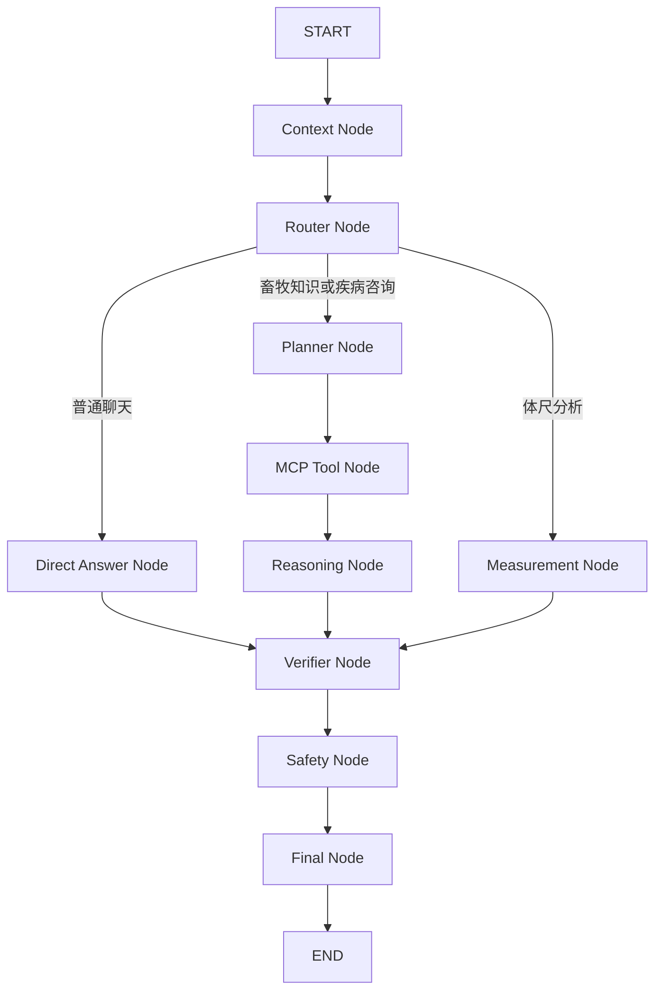

# LangGraph 工作流迁移说明

## 迁移动机

本项目原有的 `graph.py` 已经具备多 Agent 工作流的业务分层，但执行顺序由普通 Python 函数直接控制。此次迁移使用 LangGraph 显式描述节点、条件边和共享状态，目标是：

- 保留现有 FastAPI 接口、RAG-SERVER、MCP 客户端、Agent 实现、会话历史和响应结构。
- 让普通聊天、畜牧知识问答、疾病咨询和体尺分析的路由可读、可测试、可追踪。
- 将运行时依赖与可序列化工作流状态分离，避免把模型或数据库客户端写进 state。
- 为后续受控重试、人工介入和持久化恢复保留清晰的扩展点。

本次迁移只替换工作流编排层，不重写 RAG、模型调用、数据库或前端。

## 最终拓扑

条件边只决定下一节点，不在路由函数中执行模型、RAG 或数据库副作用。节点失败时记录结构化错误并进入已有降级策略，不静默切换到 fake RAG。

## State 与运行时 Context

工作流继续使用 Pydantic `MultiAgentState` 作为 LangGraph state schema。这样可以复用现有 Agent 签名、字段校验和 API 适配逻辑。LangGraph 执行结果是字典，公开入口在返回前使用 `MultiAgentState.model_validate(...)` 恢复领域模型。

RAG 客户端、LLM 客户端、`Settings`、记忆服务和会话上下文服务不是业务状态，统一通过 LangGraph `context_schema` 和 `Runtime` 注入。它们不得写入 state、trace 或未来的 checkpoint。

## 节点与现有实现映射

| LangGraph 节点 | 主要职责 | 复用的现有实现 |
| --- | --- | --- |
| Context Node | 装载对话历史、会话上下文并规范化本轮问题 | `SessionContextService`、conversation history、query normalizer |
| Router Node | 识别普通聊天、畜牧知识、疾病咨询和体尺分析 | `SupervisorAgent`、intent router |
| Direct Answer Node | 普通聊天由 LLM 直接回复，不调用 RAG | `DirectAnswerAgent` |
| Planner Node | 生成受约束的 MCP 调用计划和检索参数 | LangGraph 节点适配器、现有 RAG 查询构造逻辑 |
| MCP Tool Node | 调用真实 RAG-SERVER 并标准化检索结果 | `RagAgent`、`RagServerClient` |
| Reasoning Node | 只依据已检索内容组织畜牧答案；无依据时执行明确降级 | `GroundedAnswerAgent`、RAG answer policy |
| Measurement Node | 生成体尺分析报告 | `MeasurementAgent` |
| Verifier Node | 按当前回答类型进行通用事实、引用和完整性检查 | `VerifierAgent` |
| Safety Node | 检查疾病、用药、剂量、急症和其他高风险内容 | `SafetyAgent`、safety precheck |
| Final Node | 应用校验/安全结果并形成稳定 API 输出 | `ResponseAgent` |

疾病理解仍可由 `DiseaseAgent` 在 Planner 前完成，用来构造更准确的 RAG 查询；它不引入独立的疾病证据门禁。

## 为什么 Context 位于 Router 之前

多轮追问经常缺少独立语义，例如“那现在怎么办”。只有先装载上一轮动物种类、症状和用户已确认事实，Router 才能把它识别为畜牧或疾病问题，而不是普通聊天。Context Node 只整理当前路由所需的信息，不提前调用 RAG 或生成答案。

## Planner 与 MCP 工具边界

Planner 不是任意工具执行器。第一阶段只允许调用应用已接入并经过测试的 MCP 工具：

- `query_knowledge_hub`：畜牧知识库检索。

工具名必须命中代码中的固定白名单；`top_k` 必须经过范围校验；collection 由服务端配置决定，不能由模型任意覆盖。新增 `list_collections`、`get_document_summary` 或其他工具必须先补充参数模型、权限边界和端到端测试。

Tool Node 只负责执行计划和记录结构化结果。它不生成最终答复。RAG 返回内容交给 Reasoning Node 作为事实依据，由 LLM 组织自然语言答案并保留安全来源元数据。

## 通用 Verifier 与 Safety

Verifier 根据回答路径执行不同校验：

- 普通聊天不要求 RAG 引用，不能因为缺少检索证据而拒绝正常互动。
- 畜牧知识回答检查正文是否由检索内容支持、来源是否真实存在。
- RAG 无结果或低置信度时，不编造事实或来源，转为明确的无依据参考回答。
- 体尺分析检查结构化结果和输入数据的一致性。

Safety 位于所有回答路径的 Final Node 之前。疾病、用药、剂量和急症风险由 Safety 统一处理；Verifier 不承担疾病诊断，也不重新引入疾病专用证据检查。Final Node 不再自由改写已校验内容，只应用安全结果和输出格式。

## 本次不启用 checkpoint

本次只增加 LangGraph 编排依赖，不增加 `langgraph-checkpoint-sqlite`，也不启用 checkpoint，原因如下：

- 当前 conversation、QA log 和 session context 已经是会话历史的持久化来源。
- 同一个 `thread_id=session_id` 会合并上一轮 state；若瞬态字段未显式清空，可能把旧草稿、引用或安全结果带入新一轮。
- 同时维护业务数据库和 LangGraph checkpoint 会形成两套恢复来源，需要先定义一致性、清理和数据保留策略。
- FastAPI 异步服务需要在完整 lifespan 内管理 `AsyncSqliteSaver` 连接；这不属于本次编排迁移的必要范围。

未来启用 checkpoint 前，应先加入 turn reset 节点、数据库清理策略、并发测试和恢复演练，再将 `thread_id` 映射为 `session_id`。单元测试可使用 LangGraph 内置的 `InMemorySaver`，无需生产依赖。

## 测试策略

迁移必须保持现有外部行为，并按以下顺序验证：

1. 图结构测试：节点注册、START/END、条件边和所有合法路由均可到达 Final Node。
2. 节点测试：普通聊天不调用 RAG；畜牧问题调用真实 Tool Node；工具错误、空证据和安全拒绝按策略降级。
3. API 集成测试：`/api/chat`、体尺分析、会话历史和 trace contract 保持兼容。
4. 完整回归：运行项目全部非外部依赖测试以及现有发布检查。
5. 真实端到端：启动应用和 RAG-SERVER，在浏览器中使用鼠标与键盘验证普通聊天、畜牧 RAG、多轮追问、会话切换、错误提示和 Markdown 展示。

验收时还需检查 trace，确认实际节点路径与页面回答一致，普通聊天没有 RAG 工具记录，畜牧回答包含真实检索状态。

## 回滚策略

迁移保持 API schema、数据库 schema、RAG-SERVER 和前端协议不变，因此没有数据回滚步骤。出现回归时可直接撤销迁移提交或合并提交，恢复原有 Python 顺序编排。回滚后重新运行健康检查、聊天集成测试和浏览器 smoke，确认旧入口恢复。

迁移分支在完整测试和浏览器验收通过前不得合并；合并时只包含 LangGraph 编排、对应测试、依赖声明和本说明，不夹带运行数据库、日志或本地配置。
