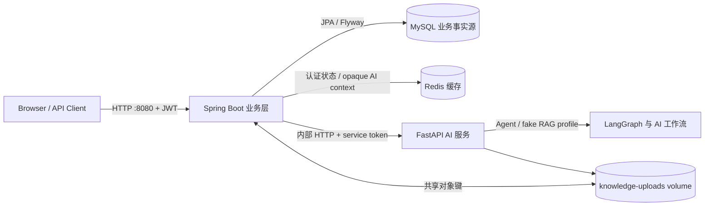
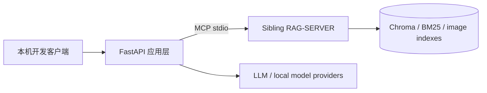

# V7 As-built 架构与边界

本文描述当前代码已经实现并通过验收的系统，而不是未来规划。历史设计基线见 `DEV_SPEC_V7_JAVA_ENTERPRISE_INTEGRATION.md`，阶段证据见 `docs/reports/`。

## 1. 可复现 Compose 拓扑

只有 Java `127.0.0.1:8080` 发布到宿主机。MySQL、Redis 和 Python AI 仅在 Compose 内部网络可达。浏览器令牌终止于 Java，Python 不接收或解释用户 JWT。

当前 Compose 固定使用 `config/settings.compose.yaml` 和 `RAG_QUERY_MODE=fake`，用于可重复的服务集成、状态机、安全和性能回归。该 profile 的结果不能描述为真实知识库或真实模型性能。

## 2. 本机真实 RAG 开发拓扑

本机可通过显式配置接入 sibling `RAG-SERVER`，用于真实 collection、citation/source URI 和评测。该路径没有被封装进当前 Docker 镜像；`docs/adr/0003-rag-server-packaging.md` 仍为 Proposed。关闭该缺口至少需要：

1. 固定 RAG-SERVER 版本或制品；
2. 在镜像中安装其依赖并复制可运行资产，或拆为独立内部服务；
3. 使用真实 collection 完成 Compose readiness、查询和质量门禁；
4. 单独记录模型、知识库、规模和真实性能证据。

在完成上述条件前，不得宣称“Compose 已部署真实 RAG”。

## 3. 服务职责

| 能力 / 数据 | 权威所有者 | 说明 |
| --- | --- | --- |
| 用户、角色、权限、状态 | Java + MySQL | Spring Security JWT、RBAC 与资源所有权 |
| refresh family、撤销状态 | Java + Redis | Redis 只保存不可逆摘要与 TTL；故障时 fail-closed |
| 会话、消息、业务任务、审计 | Java + MySQL | Java 是唯一业务事实源 |
| `contextVersion` | Java + MySQL | MySQL 为唯一版本权威 |
| opaque AI context | Java + Redis | 缓存可丢失；由历史安全重建 |
| RAG、Agent、问诊、模型、安全与评测 | Python | 对 Java 暴露版本化 `/internal/v1` HTTP 契约 |
| Python execution record | Python SQLite 运维卷 | 仅用于响应丢失后的 operation 对账，不是业务事实 |
| 向量、BM25、图片索引 | RAG-SERVER | 不迁入 Java MySQL |
| 文档元数据、索引任务 | Java + MySQL | 文件通过共享 volume/object key 交给 Python |

## 4. 一次 AI 会话的事务边界

1. Java 校验 JWT、权限、资源所有权、`Idempotency-Key` 和请求 `contextVersion`。
2. Java 在短事务中创建/占用业务任务并提交，调用 Python 时不持有 MySQL 长事务。
3. Java 读取与 MySQL 版本匹配的 Redis opaque context，并连同有界消息历史调用 Python。
4. Python 执行 RAG/Agent/Verifier/Safety，保存短期 execution record，返回业务 outcome、来源、工具链和下一版 context。
5. Java 以任务版本和 active operation 条件更新任务终态、消息、审计与 `contextVersion`。
6. MySQL 提交成功后，Java 才 CAS 更新 Redis context；缓存失败不会覆盖业务事实。

同一 operation 只接受一个业务结果。模型提供方计费层面的 exactly-once 无法保证，项目不作该承诺。

## 5. 可靠性和安全边界

- Python chat 默认不自动重试；超时或响应丢失通过 operation 查询对账。
- Resilience4j timeout、circuit breaker 和 bulkhead 只处理传输/依赖故障，低置信度和安全拒答仍是 HTTP 200 的业务结果。
- Redis 认证状态不可用时受保护 API fail-closed；MySQL 不可写时 Java 不先调用 Python。
- 审计不记录密码、JWT、service token、API key、完整 prompt 或未脱敏问诊文本。
- 最终回答经过 Verifier、Safety Agent 或 final guard；具体剂量、确定性诊断和无依据引用受限。

## 6. 已验证与未覆盖

已验证：四服务 Compose、IAM/RBAC、会话/任务/审计、迁移对账、Java→Python HTTP、文档索引、体尺分析、结构化日志、Prometheus、依赖故障恢复、安全扫描、stub 性能和浏览器 E2E。

未覆盖：Kubernetes、服务网格、MySQL/Redis HA、生产备份自动化、生产告警、互联网部署、真实 LoRA 默认推理、真实 RAG Compose 打包及真实模型性能。项目应描述为“本机可复现的企业 AI 集成系统”，而不是“银行级生产系统”或“高可用微服务集群”。
